# はじめに
wip

# トランザクションの分離性とは何か？

トランザクション分離レベルはACID特性における、I、Isolation（分離性）に関係してくる。

ACIDについての説明は割愛。

**分離性**とはトランザクション同士がお互いに干渉せずに処理が分離されている、という意味。

たとえ2つのトランザクションが同時に実行されたとしても、一方のトランザクションは他方のトランザクションに影響を与えず処理を進めなければならならない。

仮にトランザクション同士が並行に実行されて同じデータにアクセスしてしまうと不整合な結果となってしまい問題が発生します（並行性の問題をレース条件と呼ぶ）。

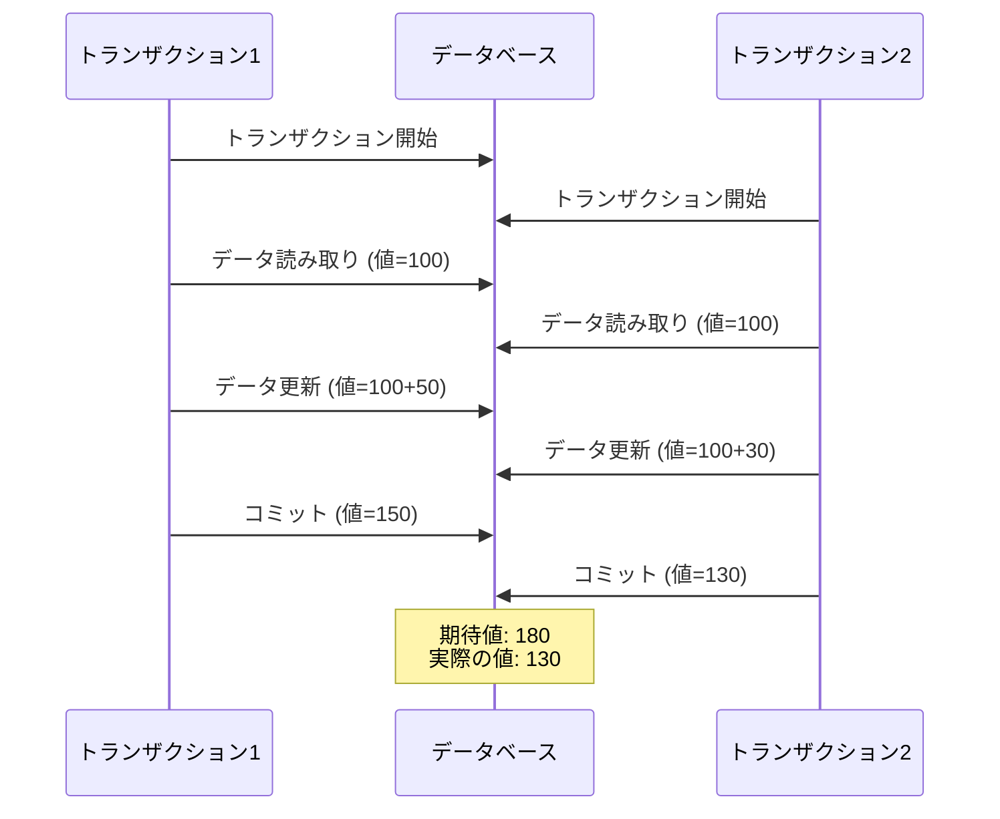

この例では、2つのトランザクションが同時に同じデータ（値=100）を読み取り、それぞれ50と30を加算しようとしています。理想的には最終的な値は180（100+50+30）となるべきですが、実際には後からコミットされた値130が残ってしまい、トランザクション1による更新が失われてしまいます。

上記の例はダーティライトと呼ばれる問題（後述）

このようなレース条件を発生させないためにデータベースは分離性を提供しています。

# 分離性が保証されていないとどのような問題が起こるのか？

分離性が保証されていない場合には、トランザクション同士が並行に実行されることによって先ほどの例のような問題が生じてしまいます。それ以外にも発生する問題がいくつかあるため、整理していきます。

## ダーティリード

SQL92にて、並行に実行されているトランザクションの実行中に発生し得る現象の一つとして定義されているのがダーティリードです。

あるトランザクションが 、**コミット前の他のトランザクションの変更内容**を読み取ってしまう現象のことです。

コミット前のデータは、ロールバックによって変更内容が破棄される可能性があります。

例えば、

商品Aの在庫数を更新するトランザクションTX1と、同じ商品の在庫数を確認するトランザクションTX2があるとする。

1. TX1は商品Aの在庫数を100から80に更新する（コミット前）
2. TX2は商品Aの在庫数を読み取る
3. TX1がロールバックする
    1. 何らかの理由で在庫数の更新処理が破棄される
    2. 結果、在庫数は100のままになる
4. TX2が破棄された在庫数を元に何らかの処理を進める
    1. 3で80への更新が破棄されているが、TX2では読み取った80という値で処理が進んでしまう

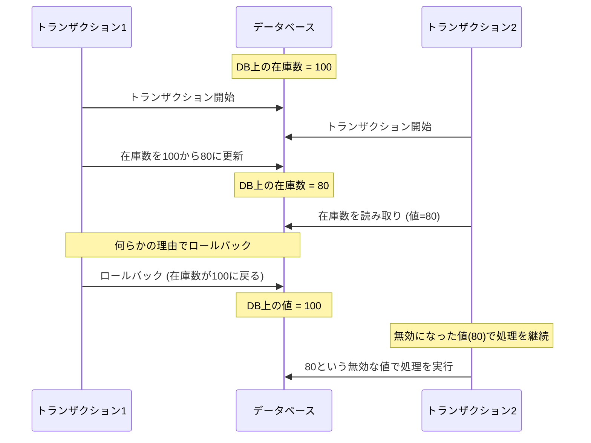

上記の図は、ダーティリードの問題を示しています。トランザクション2が、トランザクション1のコミット前の更新（まだ確定していない値）を読み取ってしまい、その後トランザクション1がロールバックした場合でも、トランザクション2は無効となった値で処理を続行してしまう状況を表しています。

## ダーティライト

説明wip

例えば、

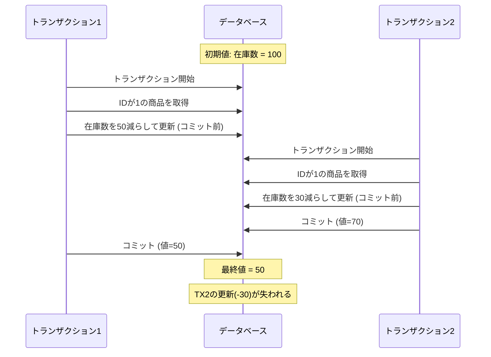

上記の図では、トランザクション2がトランザクション1の開始後に開始され、トランザクション1の終了前にコミットする状況を示しています。この場合、TX2の更新が失われる結果となります。

## nonrepeatable read（読み取りスキュー）

読み取りスキューは、同一トランザクション内で同じデータを複数回読み取った際に、**他のトランザクションの更新によって異なる値が読み取られてしまう**現象のことです。

例えば、

口座残高を確認するトランザクションで以下のような状況が発生します：

1. TX1が口座Aの残高を読み取る（1000円）
2. TX2が口座Aに500円入金してコミットする（残高1500円）
3. TX1が再度口座Aの残高を読み取る（1500円）

この場合、TX1の中で同じデータを2回読み取っているにもかかわらず、異なる値が取得されてしまいます。これは、TX1の実行中にTX2による更新が入ってしまったためです。

TX1が2回目に読み取ったデータはコミット後の値なので、ダーティリードにはなりません。

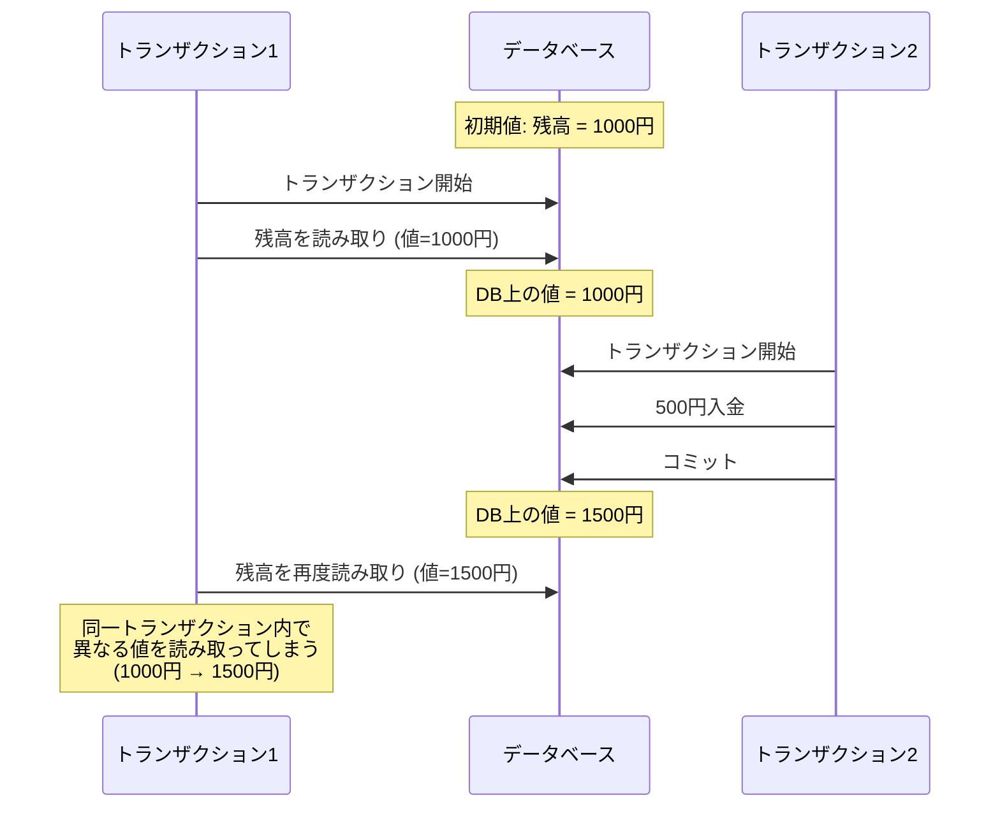

これを解決するには、トランザクション内で一貫性のあるスナップショットから読み取りを行う必要があります。

上の例を参考にすると、TX1の開始時点の残高を一貫性のあるスナップショットとして読み取り、2回目に口座Aの残高を読み取る際もそのスナップショットを参照します（TX2が1500に更新するが、TX1の開始時点の1000を取得する）。

## 更新のロスト

更新のロストは、複数のトランザクションが同じデータを読み取って更新する際に、一方のトランザクションによる更新が他方のトランザクションによって上書きされてしまう問題です。

例えば、商品の在庫を更新する際に以下のような状況が発生します：

1. TX1とTX2が同時に在庫数100を読み取る
2. TX1は在庫を10減らして90に更新する
3. TX2は在庫を20減らして80に更新する
    1. TX1の更新後の値を参照してしまうとダーティリードとなってしまうため100を参照する
4. TX1がコミットする（在庫=90）
5. TX2がコミットする（在庫=80）

この場合、最終的な在庫数は70（100-10-20）になるべきところ、TX2の更新（80）で上書きされてしまい、TX1による更新（-10）が失われてしまいます。

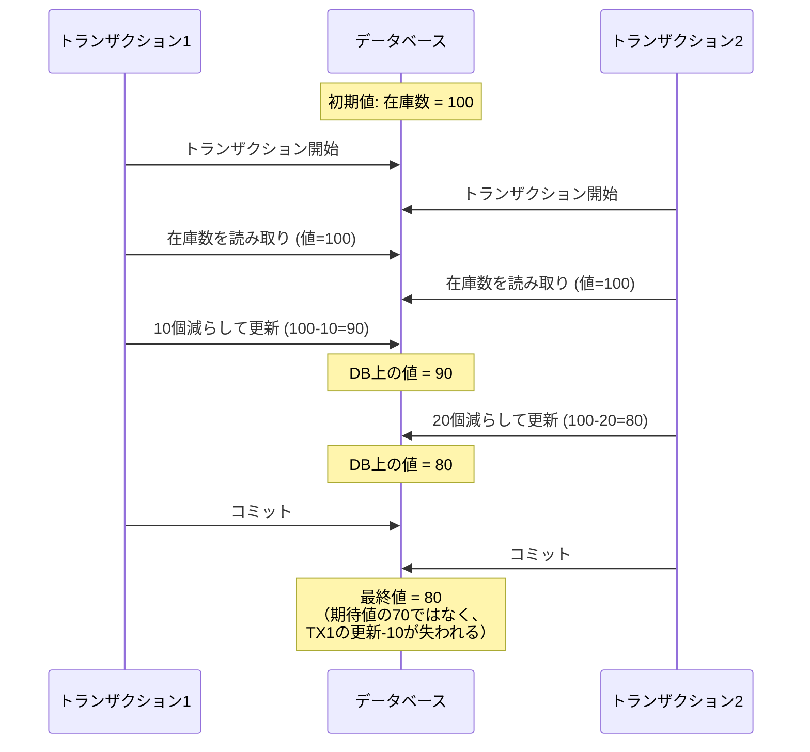

この問題はアトミックな更新処理を行うことで解決できます。

https://dev.mysql.com/doc/refman/8.0/ja/innodb-locks-set.html

https://qiita.com/mpyw/items/14925c499b689a0cbc59

https://zenn.dev/tmtms/articles/202103-mysql-deadlock

## 書き込みスキュー

書き込みスキューは、2つのトランザクションが同時に実行され、それぞれが異なるデータを読み取って更新を行う際に発生する問題です。各トランザクションは個別のデータを更新するため、ダーティライトは発生しませんが、トランザクション全体としては不整合な状態になってしまいます。

例えば、医師の当直スケジュール管理システムで以下のような状況が発生します：

1. 病院のルールとして「必ず2人以上の医師が当直していなければならない」とする
2. 現在、医師AとBが当直しており、2人とも休暇を取りたいと考えている
3. TX1: 医師Aが当直医リストを確認（医師A,B在籍）し、まだ1人残るので自分の当直を外す
4. TX2: 医師Bが当直医リストを確認（医師A,B在籍）し、まだ1人残るので自分の当直を外す
5. 結果として当直医が0人になってしまい、ルール違反の状態となる

この問題は、各トランザクションが読み取り時点での整合性チェックは行っているものの、コミット時には他のトランザクションの変更を考慮していないために発生します。

## ファントム

ファントムは、あるトランザクションが実行中に、別のトランザクションによって新しい行が追加または削除されることで発生する問題です。これにより、同じクエリを実行しても異なる結果が得られる可能性があります。

例えば、以下のような状況で発生します：

1. TX1が「売上が1000万円以上の顧客」を検索する
2. TX2が新しい顧客（売上1500万円）を追加する
3. TX1が再度「売上が1000万円以上の顧客」を検索すると、前回とは異なる結果が返される

この問題は特に集計クエリ（COUNT、SUM等）を実行する際に重要です。トランザクション中に他のトランザクションによってデータが追加・削除されると、集計結果の整合性が保てなくなる可能性があります。

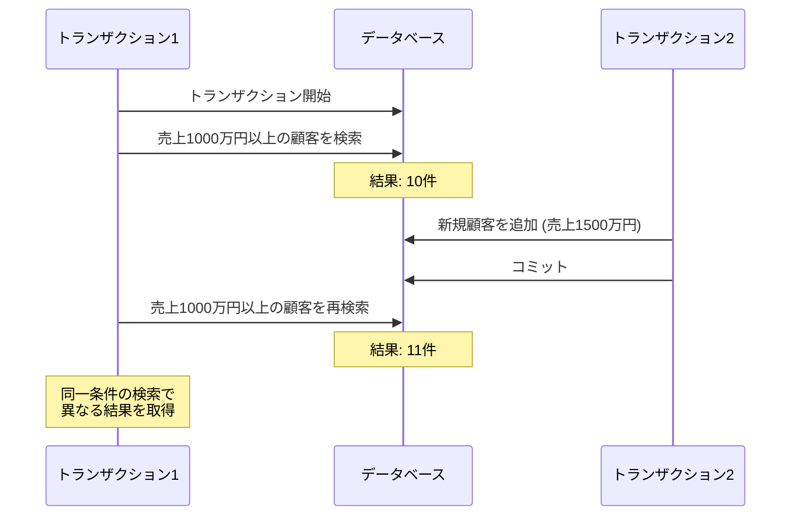

ファントム問題を防ぐには、検索条件に該当する可能性のある範囲をロックする「範囲ロック」が必要になります。

今回の場合だと、売り上げが1000万以上のレコード全てでロックを取得することで、同じ条件のレコードが挿入される際に共有ロックにぶつかり、ロックの開放を待つことになります。

# トランザクション分離レベル

[ANSI SQL標準](https://www.microsoft.com/en-us/research/wp-content/uploads/2016/02/tr-95-51.pdf)では、READ UNCOMMITTED、READ COMMITTED、REPEATABLE READ、SERIALIZABLEの4つの分離レベルが定義されています。今回はこの4つの分離レベルに加え、[A Critique of ANSI SQL Isolation Levels] で紹介されているSnapshot分離を取り上げます。

それぞれの分離レベルで何を保証しているのかを理解することで、上記で説明したレース条件による問題がどのように防げるのかを見ていきましょう。

※SQL92の分離レベル（実装によらないもの）をまずは解説して、その後に一般的な実装方法を紹介する

## READ UNCOMMITTED

ダーティライトが生じないことを保証します。

最も低い分離レベルで、他のトランザクションがコミットしていない変更も読み取ることができます。

ダーティライトを回避することができますが、それ以外の上記で説明した問題は発生する可能性があります。

## READ COMMITTED

この分離レベルは、ダーティライトとダーティリードが生じないことを保証します。

ダーティライトとダーティリードを回避することができますが、それ以外の上記説明した問題は発生する可能性があります。

## Snapshot

この分離レベルは、トランザクションの開始時刻のデータのスナップショットを保存し、そのスナップショットに基づいて一貫した読み取りを提供します。

これにより、ダーティライト、ダーティリード、読み取りスキュー、更新のロストを防ぐことができます。ただし、書き込みスキューやファントムの一部は依然として発生する可能性があります。

スナップショット分離レベルにおけるトランザクションの動作は以下のような流れになります

1. トランザクションTX1開始時に、その時点でのデータベースの状態のスナップショットを作成
2. TX1内の読み取り操作は、全てこのスナップショットに対して実行される
3. TX1内の書き込み操作は、このスナップショットに対して実行・反映される
4. コミット時に、TX1以外のトランザクションが、TX1が書き込みをしたデータに書き込み処理をしていない場合に限りコミットに成功する
    1. TX1が書き込みをしたデータに書き込み処理があった場合には、Firstcommitter-winsという機能により、競合する更新を検出して更新ロストを防ぐ

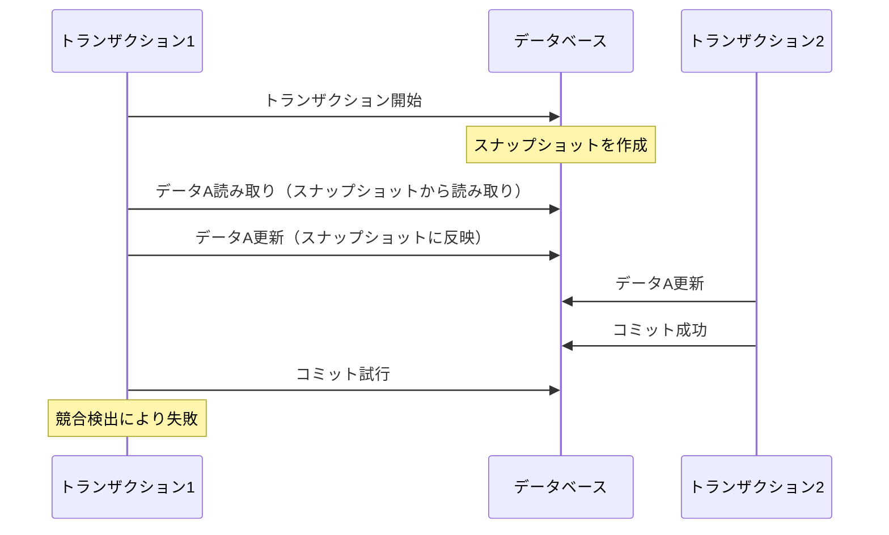

スナップショット分離では、読み取りのみを行うファントムは防げますが、読み書きを伴うトランザクションについては、ファントムによって書き込みスキューが発生してしうケースがあります。

以下のようなケースではファントムを防ぐことができます。

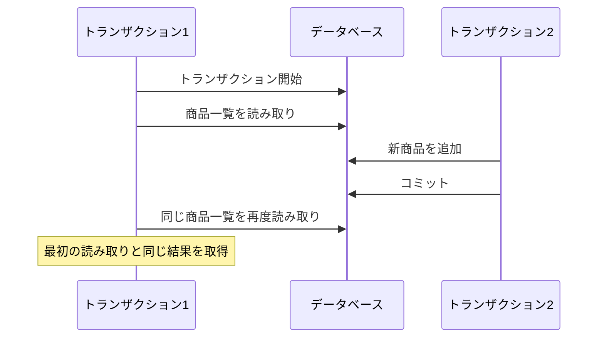

**条件付きの制約チェック**

以下は、「特定の会議室の予約人数が0人」という条件がある場合の例です。2つのトランザクションが同時に予約を試みると、制約違反が発生する可能性があります。

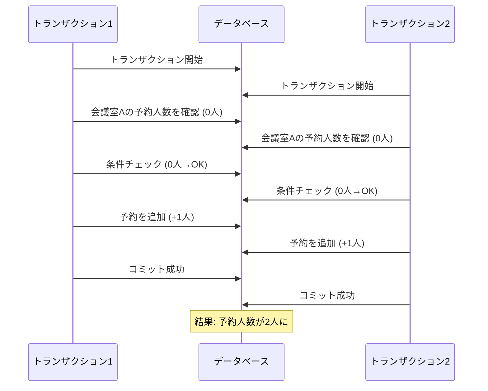

このケースでは、両方のトランザクションが同時に0人という状態を読み取り、それぞれが1人追加する処理を実行します。結果として2人の予約が成立してしまい、「1人以下」という制約に違反してしまいます。

これは典型的な書き込みスキューの例です。各トランザクションは異なるレコード（予約）を作成していますが、それらの組み合わせが制約に違反する結果となっています。同時に、新しい予約レコードの作成によるファントム問題も含んでいます。

このような問題を防ぐためには、以下のような対策が考えられます：

- SERIALIZABLEトランザクション分離レベルを使用する
- 明示的なテーブルロックを使用する
- アプリケーションレベルでの排他制御を実装する

## REPEATABLE READ

トランザクション中の同じ読み取り操作は常に同じ結果を返すことを保証することで、読み取りスキュー（nonrepeatable read）を回避します。

## SERIALIZABLE

最も強い分離レベルで、トランザクションが順番に実行されているかのように動作します。先ほど説明した問題を全て回避することができます。

## 各分離レベルと回避できる問題の対応関係

ここで紹介する対応関係は、あくまで論文内の分離レベルにおける話です。
なので、MySQLやPostgreSQLのような具体的なDBMSが下の表に必ず当てはまるわけではないことに注意してください。

✅→防止、❌→発生、🔺→ケースによって発生する

| 分離レベル | ダーティライト | ダーティリード | 更新のロスト | 読み取りスキュー | 書き込みスキュー | ファントム |
| --- | --- | --- | --- | --- | --- | --- |
| READ UNCOMMITTED | ✅ | ❌ | ❌ | ❌ | ❌ | ❌ |
| READ COMMITTED | ✅ | ✅ | ❌ | ❌ | ❌ | ❌ |
| Snapshot | ✅ | ✅ | ✅ | ✅ | ❌ | 🔺 |
| REPEATABLE READ | ✅ | ✅ | ✅ | ✅ | ✅ | ❌ |
| SERIALIZABLE | ✅ | ✅ | ✅ | ✅ | ✅ | ✅ |

分離レベルが高くなるほど整合性は保たれますが、その分並行性が低下しパフォーマンスが低下する傾向があります。そのため、アプリケーションの要件に応じて適切な分離レベルを選択することが重要です。

# トランザクション分離レベルの実装方法

## READ UNCOMMITTED

ダーティライトは、行ロックを用いて回避します。トランザクション内で更新したいレコードがある場合は、更新前にロックを取得します。このロックは、そのトランザクションがコミットまたは中断されるまで保持され、別のトランザクションが同じレコードを更新しようとすると、ロックが解放されるまで待機することになります。

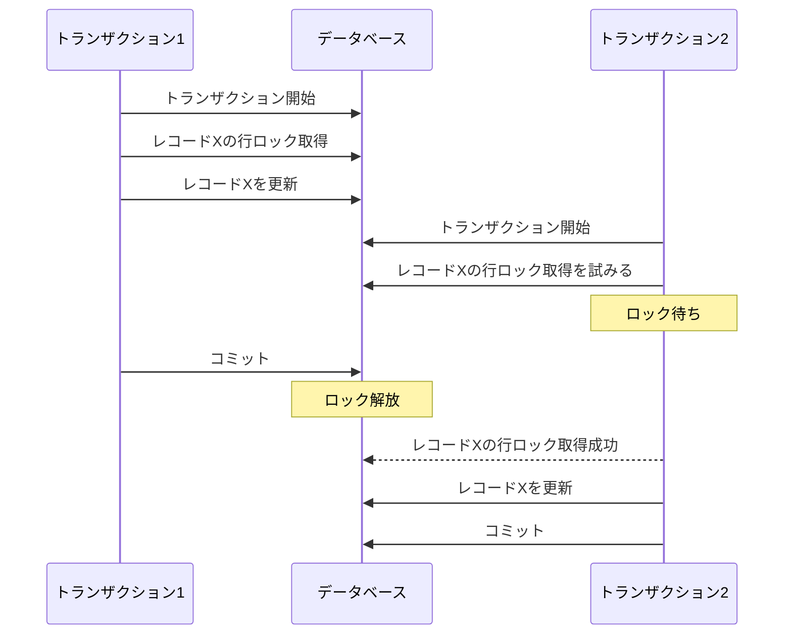

## READ COMMITTED

ダーティリードは、トランザクション内でレコードの読み取りを行う際は、コミット済みの古い値を返し、一貫性のあるデータを返すことで回避します。

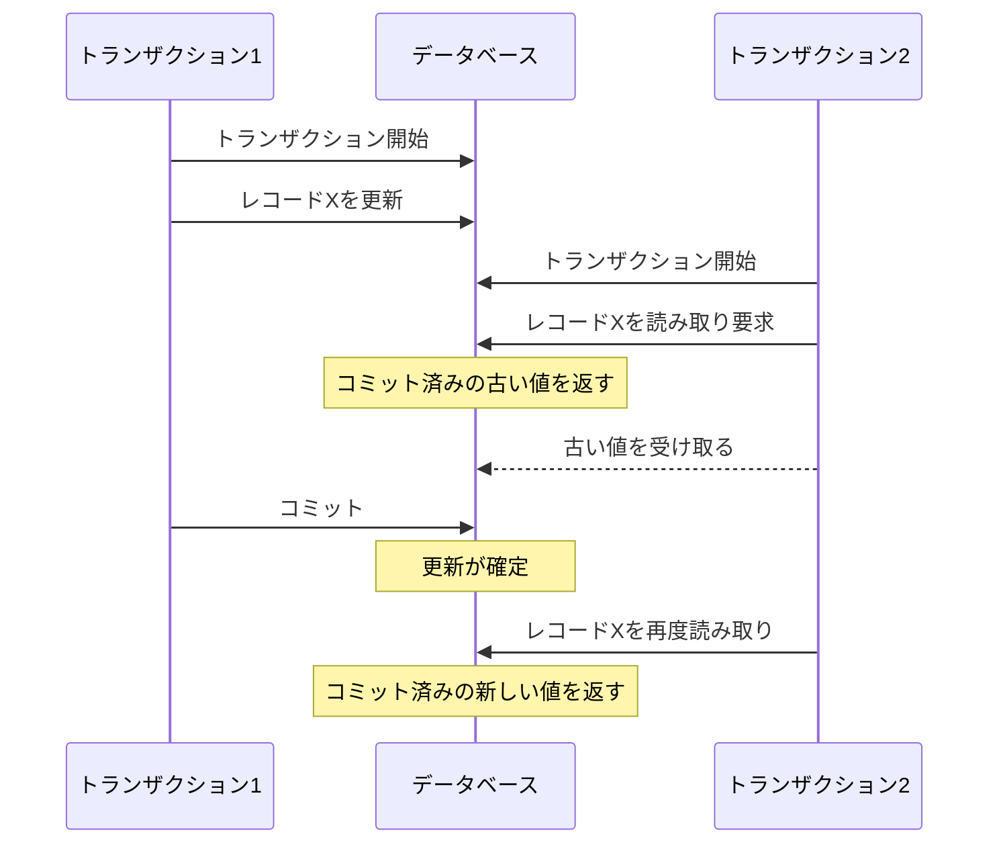

この図のように、トランザクション2がレコードXを読み取る際に、トランザクション1が更新中（未コミット）の場合は、更新前の値（コミット済みの古い値）を返すことでダーティリードを防ぎます。

ダーティライトとダーティリードは防げますが、読み取りスキュー・更新のロスト・ファントムは防ぐことができません。

## Snapshot

この分離レベルでは、多くのデータベースでMVCC（Multi-Version Concurrency Control）という手法が使用されています。
MVCCは、MySQL・PostgreSQL・SQL ServerといったRDBで採用されており、データベースが同じデータの複数のバージョンを保持することで、トランザクション間の競合を減らす仕組みです。

簡単な例で説明すると：

1. あるレコードの値が「100」だとします
2. トランザクション1がそのレコードを読み取ります
3. トランザクション2がそのレコードを「200」に更新します
4. この時、トランザクション1は引き続き「100」という値を見ることができます

これは、データベースが「100」という古いバージョンと「200」という新しいバージョンの両方を保持しているためです。各トランザクションは、自分が開始した時点で有効だったバージョンのデータを参照し続けることができます。

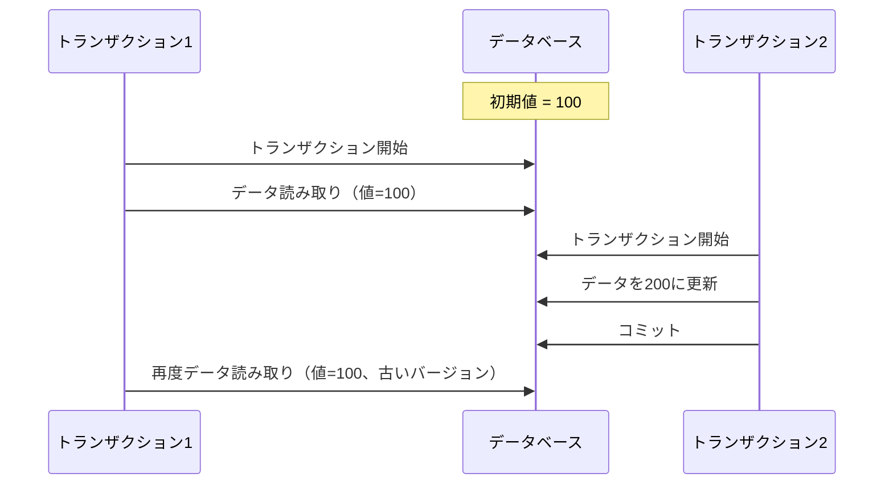

この仕組みにより、読み取り操作が書き込み操作をブロックすることなく、かつ一貫性のある読み取りが可能になります。

また、更新対象のレコードがトランザクションの開始時の状態から変更されていた場合は、更新のロストを自動検出し、トランザクションを中断します。

しかし、MySQLのREPEATABLE READ分離レベルでは更新のロストを検出しません、

（PostgreSQLでは更新のロストを検出するみたいです）

https://qiita.com/nannany_stores/items/cfba8612da261f428417

そのため、REPEATABE READ分離レベルでは更新のロストは必ず発生しないとは言い切れず、それぞれのデータベースの実装を確認する必要がありそうです。

[SQL標準の論文](https://www.microsoft.com/en-us/research/wp-content/uploads/2016/02/tr-95-51.pdf)で紹介されている分離レベルにスナップショット分離がありますが、この分離レベルでは更新のロストが生じないことが保証されています。

## REPEATABLE READ

MySQLやPostgreSQLでは、スナップショット分離レベルがREPEATABLE READと呼ばれているため、分離レベルの実装はスナップショット分離レベルと同じです。

## SERIALIZABLE

SERIALIZABLEの実装方法には主に以下の3つのアプローチがあります：

### 1. 実際の直列実行

最もシンプルな方法で、トランザクションを文字通り1つずつ順番に実行します。これは確実な方法ですが、並行性が著しく低下するため、実用的ではありません。

### 2. 二相ロック（2PL: Two-Phase Locking）

トランザクションの実行中、読み取り操作には共有ロック、書き込み操作には排他ロックを使用します。MySQLのSERIALIZABLE分離レベルで採用されています。

2PLでは、読み取りは**他の書き込みをブロック**し、書き込みは**他の読み取りと書き込みをブロック**します。ロックの獲得（フェーズ1）とロックの解放（フェーズ2）を分離することで、直列化可能性を保証します。

### 3. 直列化スナップショット分離（SSI: Serializable Snapshot Isolation）

スナップショット分離をベースに、直列化異常を検出して防止する方法です。PostgreSQLのSERIALIZABLE分離レベルで採用されています。

トランザクションの読み取り・書き込みの依存関係を追跡し、直列化が不可能になる可能性がある場合は、トランザクションの1つを中断します。これにより、高い並行性を維持しながら直列化可能性を保証します。

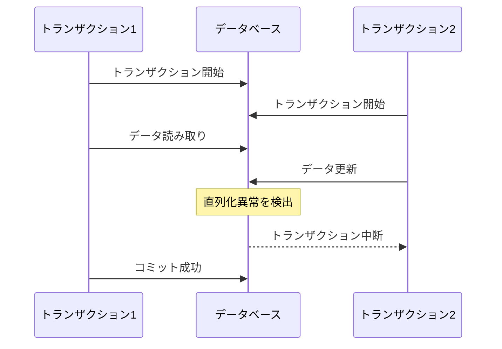

これらの実装方法の中で、現代のデータベースシステムでは主にSSIが採用される傾向にあります。SSIは、高い並行性を維持しながら直列化可能性を保証できる優れた方法だからです。

# MySQLでトランザクション分離レベルを比較してみる

wip

# 参考

https://www.amazon.co.jp/%E3%83%87%E3%83%BC%E3%82%BF%E6%8C%87%E5%90%91%E3%82%A2%E3%83%97%E3%83%AA%E3%82%B1%E3%83%BC%E3%82%B7%E3%83%A7%E3%83%B3%E3%83%87%E3%82%B6%E3%82%A4%E3%83%B3-%E2%80%95%E4%BF%A1%E9%A0%BC%E6%80%A7%E3%80%81%E6%8B%A1%E5%BC%B5%E6%80%A7%E3%80%81%E4%BF%9D%E5%AE%88%E6%80%A7%E3%81%AE%E9%AB%98%E3%81%84%E5%88%86%E6%95%A3%E3%82%B7%E3%82%B9%E3%83%86%E3%83%A0%E8%A8%AD%E8%A8%88%E3%81%AE%E5%8E%9F%E7%90%86-Martin-Kleppmann/dp/4873118700

https://sairoutine.hatenablog.com/entry/2016/02/06/193352

https://www.microsoft.com/en-us/research/wp-content/uploads/2016/02/tr-95-51.pdf

https://www.contrib.andrew.cmu.edu/~shadow/sql/sql1992.txt

https://qiita.com/immrshc/items/efc8cb31226da297c9b4

https://qiita.com/you06/items/8345670505cd2065732a

https://zenn.dev/shunjuio/articles/538238aa7f1d02

https://zenn.dev/mpyw/articles/rdb-transaction-isolations#mysql

https://zenn.dev/levtech/articles/67bedc33a4a87b#fnref-8569-1
